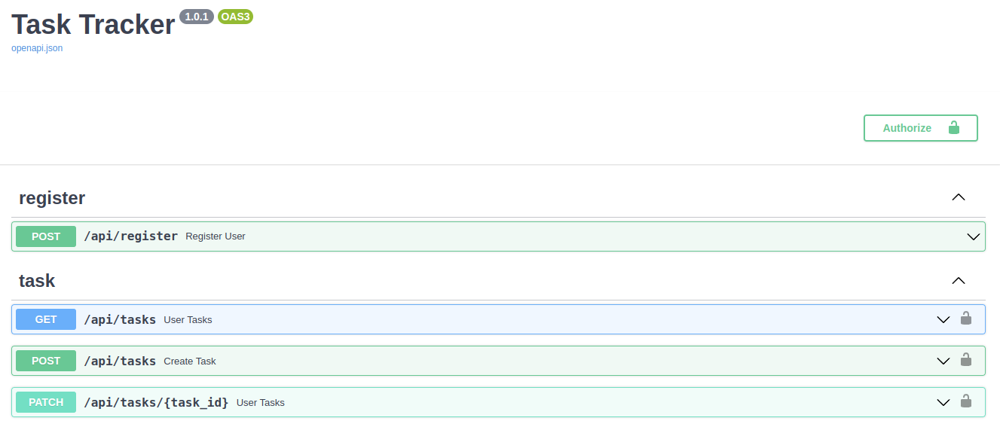

# Task Tracker

Task management system designed to improve task organisation and monitoring.
It allows users to create, manage and track tasks.

## For developers

This project is an example of a supporting backend application in the `Go` language.
It aims to combine high-performance backend with Domain-Driven Design (DDD)
and Clean Architecture techniques.
Specifically, anemic models were opted as a pattern within the Domain-Driven Design approach

## Features

* **Clean Architecture**. The architecture prioritizes encapsulating business logic and domain concerns.
Specific implementations of database/web/events/logging/other are not emphasized.
* **High Performance**. Designed with a focus on delivering efficient performance and low latency.
* **Minimal dependencies**. Using Go's rich standard library and idiomatic problem-solving
  approaches to minimize external dependencies. The project maximizes Go's capabilities.
* **Minimal amount of database requests**. Aiming for optimal performance by
minimizing the number of database requests. Some Domain-Driven Design (DDD) or Clean Architecture (CA)
applications suffer from IO performance issues due to excessive querying or
complex domain object reconstruction. This project seeks to strike a balance
that is easily comprehensible for humans while being less IO bound.

## Documentation

### Run

Run infrastructure dependencies

```shell
docker-compose up -d
```

Run a web application

```go
go run ./src/cmd/rest_api
```

### Project summary

```shell
├── src - source code root
│    ├── application - applied logic of the service, including usecases and required interfaces
│    ├── cmd - entrypoints
│    ├── domain - domain entities
│    ├── storage_adapter - data-related implementations of interfaces that are required by applied logic layer
│    └── transport
│        └── rest_api
│            ├── app
│            │    ├── app.go
│            │    └── factory
│            ├── microframework
└── swagger
    ├── openapi.json - openapi specification rendering by swagger.
    ├── ... - the rest of the files are permanent immutable and need to render swagger from openapi.json. 
```

### HTTP Api

#### Swagger
[http://localhost:8080/docs/](http://localhost:8080/docs/)

#### Register user

```shell
curl -X POST 'localhost:8080/api/register' -d '{"username": "MyUsername", "password": "example"}'
```
`{"username":"MyUsername"}`

#### Create task

```shell
curl -X POST 'localhost:8080/api/tasks' -d '{"description": "code"}' -H 'Authorization: Basic ...'
```
`{"task_id":1,"description":"code","stage":"todo"}`


#### Change task stage

```shell
curl -X PATCH 'localhost:8080/api/tasks/1' -d '{"stage": "done"}' -H 'Authorization: Basic ...'
```
`{"task_id":1}`

#### Get tasks of user

```shell
curl -X GET 'localhost:8080/api/tasks' -H 'Authorization: Basic ...'
```
`[{"task_id":1,"description":"code","stage":"todo"}]`


### Inspired by

* https://github.com/Tishka17/deseos17
* https://github.com/SamWarden/user_service

___

Still in progress.
